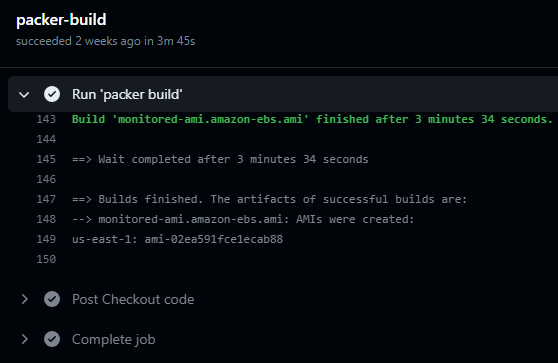

# Cloud Monitoring and Observability

Monitor EC2 instances with Datadog and Grafana using a Packer golden AMI with containerized Prometheus, provisioned by Terraform Cloud and GitHub Actions as CI/CD

### Index
* <a href="#concepts-and-tools">Concepts and tools</a>
* <a href="#solution-architecture">Solution Architecture</a>
  * <a href="#solution-flow">Solution Flow</a>
* <a href="#prerequisites">Prerequisites</a>
* <a href="#build-and-provisioning">Build and Provisioning</a>
* <a href="#destroy">Destroy</a>
* <a href="#demo">Demo</a>

---

## Concepts and tools

### Monitoring
* Monitoring is the process of systematically tracking the performance and health of a system, application, or infrastructure in real-time or over a specific period.
* Monitoring typically focuses on predefined key performance indicators (KPIs) and thresholds, enabling the detection of issues, anomalies, or deviations from expected behavior.
* It involves collecting and analyzing data, such as metrics, logs, and traces, to ensure that the system operates within acceptable parameters.
* It plays a crucial role in identifying and addressing problems, optimizing resource utilization, and ensuring the reliability and stability of systems.

### Observability
* Observability is the capacity to gain insights into the behavior and internal workings of a system, especially in complex, dynamic, and distributed environments.
* Unlike monitoring, which often relies on predefined metrics, observability emphasizes the ability to explore and understand a system's behavior with minimal prior knowledge. 
* It involves collecting detailed, high-resolution data, including metrics, logs, traces, and other telemetry, and making it available for analysis and exploration.
* Observability empowers engineers to investigate unexpected issues, diagnose root causes, and gain a deep understanding of how different components interact, ultimately leading to more effective troubleshooting, improved system design, and better decision-making.

### Prometheus
* Prometheus is a free and open-source systems monitoring and alerting tool.
* Prometheus collects time-series data from various sources, such as application metrics, system metrics, and more. It stores this data in a time-series database and provides a powerful query language for extracting useful information. 
* It uses **exporters** that are installed and configured on the clients in order to convert and expose their metrics in a Prometheus Format. And then Prometheus server scrapes the exporter for metrics.
* Prometheus also supports alerting, allowing you to define and trigger alerts based on certain conditions in your data.
* It's a core component of the modern monitoring and observability stack, and often used in combination with Grafana for visualizing metrics.

### Grafana
* Grafana is an open-source platform for observability and visualization. It has a free pricing option (https://grafana.com/pricing/).
* It is commonly used to create interactive and customizable dashboards for monitoring various data sources, including Prometheus, InfluxDB, Elasticsearch, and many more.
* Grafana allows you to build rich visualizations, such as graphs, charts, and tables, and to set up alerts based on your data.
* It provides a user-friendly interface for creating and sharing dashboards, making it an essential tool for monitoring and observability in the DevOps and SRE (Site Reliability Engineering) domains.

### Datadog
* Datadog is a popular cloud-scale monitoring and analytics platform used for real-time observability of applications and infrastructure. It has a free pricing option (https://www.datadoghq.com/pricing/).
* It provides comprehensive visibility into your applications, services, and infrastructure by collecting and analyzing data from various sources, including metrics, traces, and logs.
* Datadog offers a wide range of integrations with cloud providers, databases, and other services, making it suitable for monitoring complex and distributed environments.
* With Datadog, you can create custom dashboards, set up alerts, and gain insights into the performance and health of your systems.

---

## Solution Architecture

### Solution Flow

1. The DevOps team prepares the required files and push the code to a GitHub repo. 
* ``docker-compose.yml`` installs and configures **Prometheus** and **Node Exporter** to push metrics into **Grafana Cloud**.
* **Packer** package file builds an AMI, based on Amazon Linux 2023, that install and run ``docker-compose.yml``
* **Terraform** configuration files will create EC2 instances with the Golden AMI created by Packer. Terraform state and lock are handled by **Terraform Cloud**.

2. **GitHub Actions** triggers a workflow whenever new code is pushed. This workflow perform 3 jobs in the following order:
   1. Delete any existing Golden AMI created by Packer, so that an updated one is used.
   2. Triggers ``packer build`` command to create a new AMI.
   3. Triggers ``terraform apply`` command to build infrastructure.

3. Terraform creates a secret called **GRAFANA-SECRETS** in the **AWS Secrets Manager** that contains the **Grafana Cloud** credentials. When the EC2 are provisioned, the **user_data script** will use these credentials to update the ``prometheus.yml`` configuration file and push infrastructure metrics to the right account.

4. **Datadog**'s integration requires two steps:
   1. Provision all the required configuration and services (CloudWatch, CloudTrail, APIs, etc.) from Datadog into AWS by using a **CloudFormation** template provided by Datadog.
   2. Datadog monitors the AWS account and the used services, displayed in its web GUI. 

---

## Prerequisites

#### 1. Create an AWS account and ACCESS KEYS
* Visit https://aws.amazon.com/
* Click on the "Create an AWS Account" button and follow the registration process. You will need to provide your personal information and payment details.
* After your AWS account is set up, sign in to the AWS Management Console.
* In the AWS Management Console, navigate to the "IAM (Identity and Access Management)" service.
* Create an IAM user for programmatic access by following these steps:
  * Click on "Users" in the left sidebar.
  * Click on the "Add user" button.
  * Enter a username and select "Programmatic access" as the access type.
  * Set permissions for the user according to your requirements. For basic Terraform usage, you might want to attach the "AdministratorAccess" policy to the user for simplicity. However, it's recommended to follow the principle of least privilege and grant only the necessary permissions for your specific use case.
  * Access the user, go to Security credentials and create an access key for a third-party service. Note down the ACCESS_KEY_ID and SECRET_ACCESS_KEY when they are displayed. These keys are required for AWS CLI and Terraform operations.

#### 2. Create a Grafana Cloud account and API token
* Visit https://grafana.com/auth/sign-up/create-user and follow the steps to create a **Free Forever Cloud** account.
* Once the account is created, generate the Prometheus connection keys with the following steps:
  * Go to **"Add new connection"** menu and select **"Hosted Prometheus metrics"** 
  * Choose **"From my local Prometheus server"** method for forwarding metrics. You can leave **"Send metrics from a single Prometheus instance"** as default.
  * Type an **API token name** when configuring remote_write and hit **"Create token"**
  * Make sure you save the configuration provided by Grafana Cloud, specially the **url**, **username** and **password**

#### 3. Import Node Exporter Full dashboard
* Go to Grafana Cloud > Dashboards > New > Import
* Select to import the existing ``1860`` dashboard ID
* This will import https://grafana.com/grafana/dashboards/1860-node-exporter-full/

#### 4. Create a Datadog account and integrate your AWS account
* Visit https://www.datadoghq.com/ and hit **"Get Started for Free"** in order to create an account.
* Once the account is created, follow the steps at https://docs.datadoghq.com/getting_started/integrations/aws/ in order to integrate and monitor your AWS account services with Datadog.

#### 5. Create a Terraform Cloud account and API token
* Visit https://app.terraform.io/public/signup/account and follow the steps to create an account.
* Once the account is created, create a **user API token** at User Settings > Tokens.
  * Be careful not to generate an Organization token, since it does not have permission to perform plan and applies in workspaces.
* Save the API token, as you will only see it once.

#### 6. Setup Terraform Cloud backend
* In order to use Terraform Cloud as backend, you need to create a new **workspace**.
* Select **API-drive workflow** type and give it a name.
* Once the workspace is created, access it and apply the following Variable set: **AWS Credentials**
  * Create 2 **sensitive** and **env** variables named **AWS_ACCESS_KEY_ID** and **AWS_SECRET_ACCESS_KEY** with the keys created on step 1.

#### 7. Add GitHub Actions secrets and variables
As the deployment process is automated by GitHub Actions, it's required that you create the following GitHub repository secrets and variables:

| Secrets               | Description                                         |
|-----------------------|-----------------------------------------------------|
| AWS_ACCESS_KEY_ID     | ACCESS_KEY_ID created on step 1.                    |
| AWS_SECRET_ACCESS_KEY | SECRET_ACCESS_KEY created on step 1.                |
| GRAFANA_ENDPOINT      | Grafana Cloud API token URL created on step 2.      |
| GRAFANA_USER          | Grafana Cloud API token user created on step 2.     |
| GRAFANA_PASSWORD      | Grafana Cloud API token password created on step 2. |
| TF_API_TOKEN          | Terraform Cloud API token created on step 5.        |

| Variables             | Description                                     |
|-----------------------|-------------------------------------------------|
| TF_CLOUD_ORGANIZATION | Terraform Cloud organization created on step 6. |
| TF_WORKSPACE          | Terraform Cloud workspace created on step 6.    |

---

## Build and Provisioning

In order to trigger GitHub Actions CI/CD workflow you only need to create a commit and push it to the GitHub repository.

Since Packer cannot manage AWS AMIs after they are created, and I want to only have the latest build available, I configured a script that uses the AWS CLI to find and delete an existing AMI if applicable:

After making sure the AMI name you want to use is available, the packer-build command succeeds:

The Terraform job will init and apply infrastructure changes using Terraform Cloud:

This means that can also visualize the run using the Terraform Cloud GUI:

Finally, these are the EC2 instances created:

With these IPs:

You can now verify on Grafana Cloud that these instances are pushing metrics using Prometheus:

And also check that Datadog is monitoring the instances as well:

---

## Destroy

#### Destroy Terraform infrastructure
* In order to destroy the resources created by the ``build-and-deployment.yml`` workflow you can replace the ``terraform apply`` for ``terraform destroy`` in the file, commit and push the changes to re-trigger the workflow.

#### Remove Packer build
* You can only delete the Packer AMI with the AWS Console or by running the ``delete_monitored_ami.sh`` script.

#### Remove Datadog integration
* To remove the Datadog integration you need to remove your AWS account monitoring at **Datadog > Integrations > AWS > Remove Account**
* To remove AWS resources created during the Datadog integration, do the following:
  1. Navigate to the AWS CloudFormation console and choose the Stacks page. 
  2. Select the CloudFormation stack for Datadog’s AWS Integration that you want to delete in the child AWS account.
  3. In the Stack Details pane, choose Delete.
  4. When prompted, select Delete stack.

---